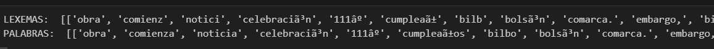
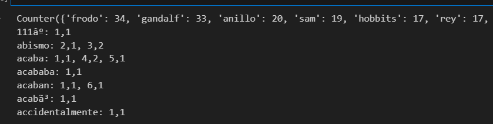
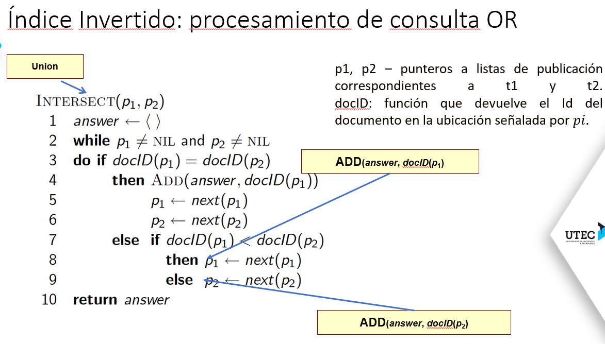
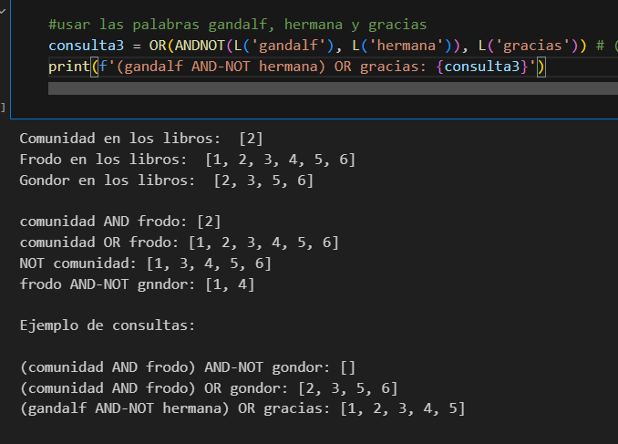
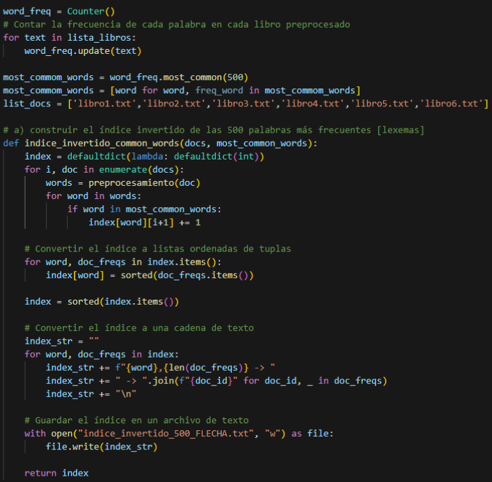
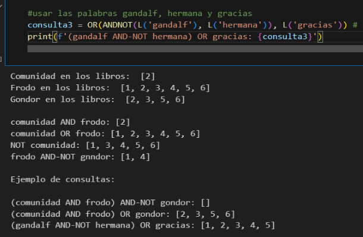
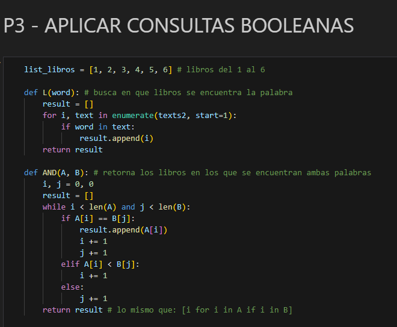
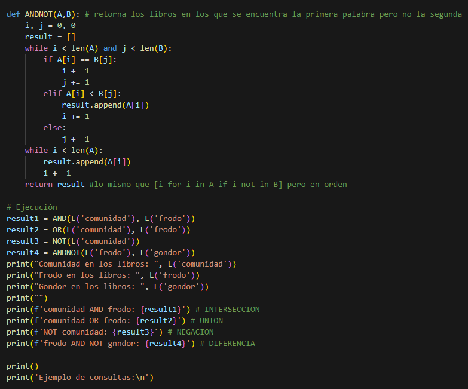
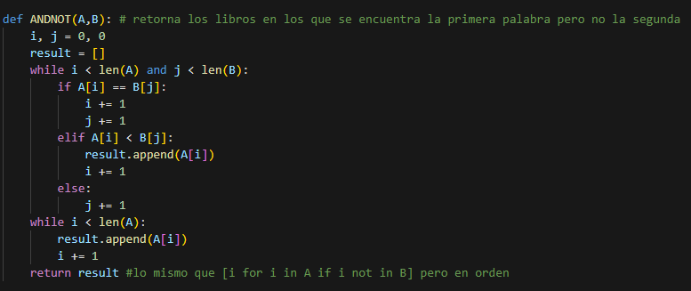
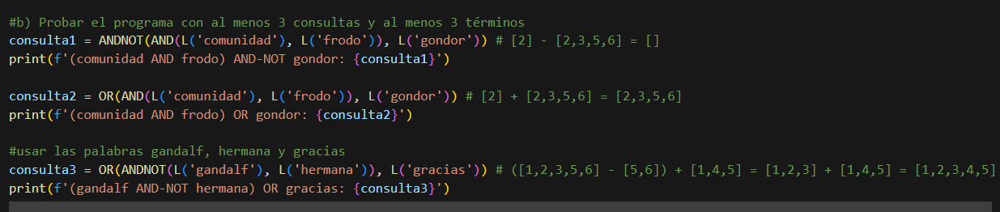

## Informe sobre el Lab 6.2 de Base de Datos 2.

## INTEGRANTES

- Ricardo Amiel Acuña Villogas
- Rodrigo Lauz Nakasone

#### 1. Introducción

- Desarrollo de Índice Invertido para recuperación de documentos .
- Para ello se está ocupando la colección de resúmenes de 6 libros de *"El señor de los anillos"*.

#### 2. Metodología

- **Preprocesamiento**:
  - Se ocupó la librería **nltk(especializada en procesamiento de lenguaje natural)**.
  - Agrego al stoplist.txt signos de puntuación para eliminar las palabras o signos que más aparezcan pero que no den una información clara del documento. Luego de ello se llamó a cada libro.txt y se hizo un split para guardar cada palabra en otros txt, esto se hace para lograr sacar los lexemas en el siguiente paso.
  - Se llama al stemming de la librería y se guarda en los txt los lexemas de cada palabra de cada uno de los textos, se guarda en una lista de listas para su uso posterior (texts para lexemas y **texts2 para palabras**).
  - Adjunto imagen del outuput, el cual retorna la lista de listas de los lexemas y palabras respectivamente. 

- **Construcción del Índice Invertido**:
  - Se ocupó la librería **collections**, el cual cuenta con un contador de frecuencias por cada elemento, justo lo que necesitamos. Además, cuenta con un método most_common(n), el cual recibe como parámetro un entero, por lo que de esa manera obtuvimos las 500 palabras más repetidas.
  - Para construir el índice invertido tomé un diccionario llamado index_words, el cual ocupará un key (palabra) y un value (tupla conformada por el libro y la frecuencia), lo que se busca es encontrar el libro y la cantidad de veces en el que aparece, en base a la key(palabra buscada) se realiza una serie de comparaciones recorriendo palabra por palabra en cada libro, si está dentro de las 500 palabras más comunes (aumenta la frecuencia y se añade junto al libro en el que se encontró), finalmente se valida que ha sido encontrado y se guarda en un archivo.
  - Adjunto imagen del output, el cual retorna el contador de frecuencias por palabra en los 6 libros, y una pequeña muestra del índice invertido, el cual muestra en la palabra y la tupla(libro,frecuencia). 
  - Acá hay otra muestra de nuestro índice invertido 

- **Funciones Booleanas**:
  - Para implementación de las funciones booleanas, es sencillo tomar los libros enumerados del 1 al 6 como enteros, por lo que la comparación fue sencilla de realizar.
  - Nuestra función L recibe una palabra y la busca en la lista de listas de palabras de cada libro, y retorna una lista con los libros en las que se encontró. A partir de ello se construyeron las 4 operaciones lógicas **AND, OR, NOT y ANDNOT**. Nos basamos en el pseudocódigo de la ppt, con la única diferencia que los parámetros que recibe son una función L() y los 'pointers' actúan tal cual memoria secundaria, adjunto imagen () 

#### 4. Resultados
- **Ejecución de Consultas Booleanas**:
  - Tomé de ejemplo las consultas del lab para probar los operadores lógicos, en base a ello generé 3 consultas que usaban 3 palabras, la tercera consulta fue elegida porque Gandalf es la palabra que más aparece en los libros del Señor de los Anillos. Adjunto imagen del output 

#### 5. Discusión
- Discusión sobre la efectividad del índice invertido en la recuperación de la información.
- Limitaciones encontradas durante la implementación y posibles mejoras.

#### 6. Conclusiones
- Conclusiones generales sobre la experiencia de implementar y utilizar el índice invertido.
- Importancia de las técnicas de preprocesamiento y normalización en la construcción de índices.

#### 7. Referencias
- Notas de clase.
- https://docs.python.org/3/library/collections.html
- https://www.nltk.org/

### Fragmento de código por pregunta:
- 
- 
- PREGUNTA 3:
  - 
  - 
  - 
  - 
