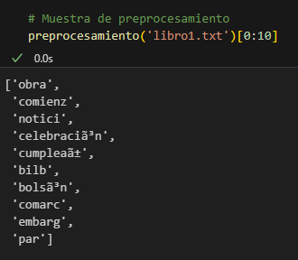
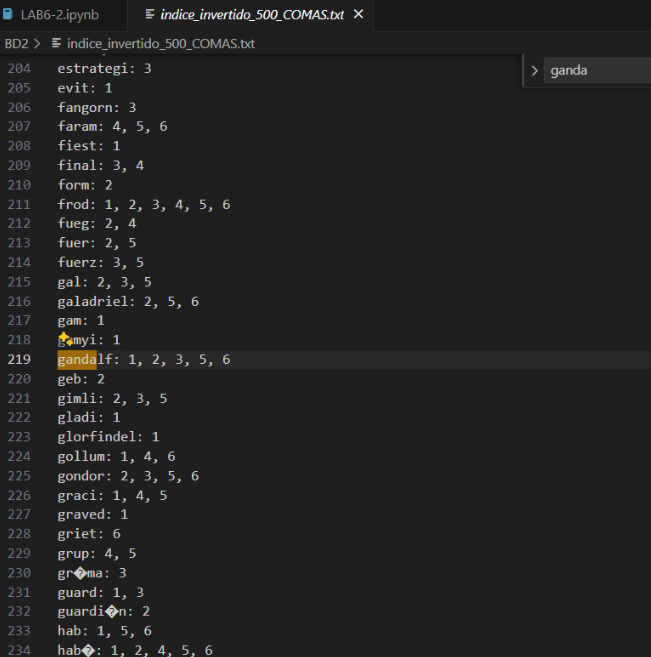
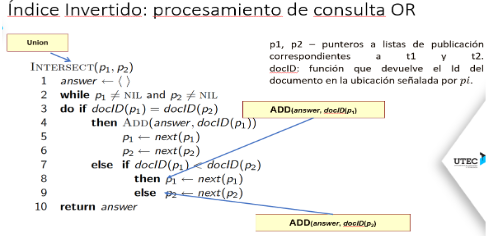
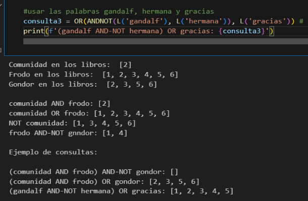
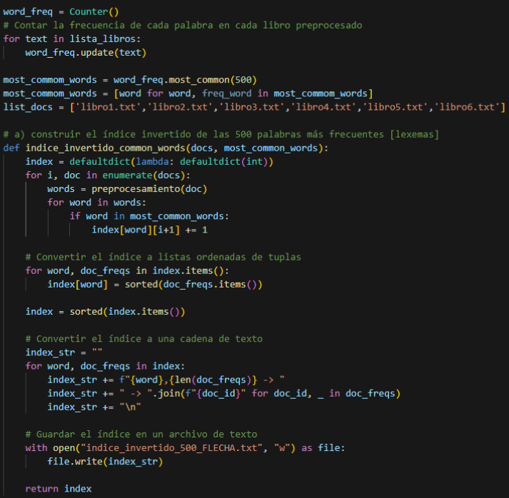
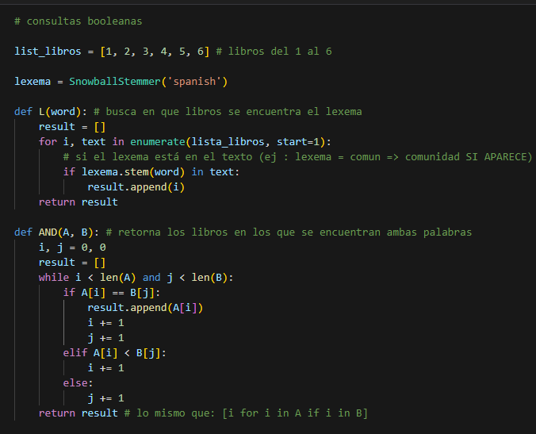
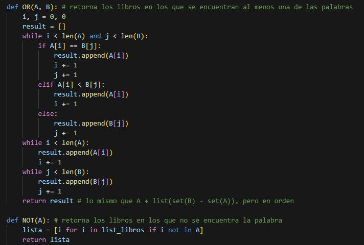
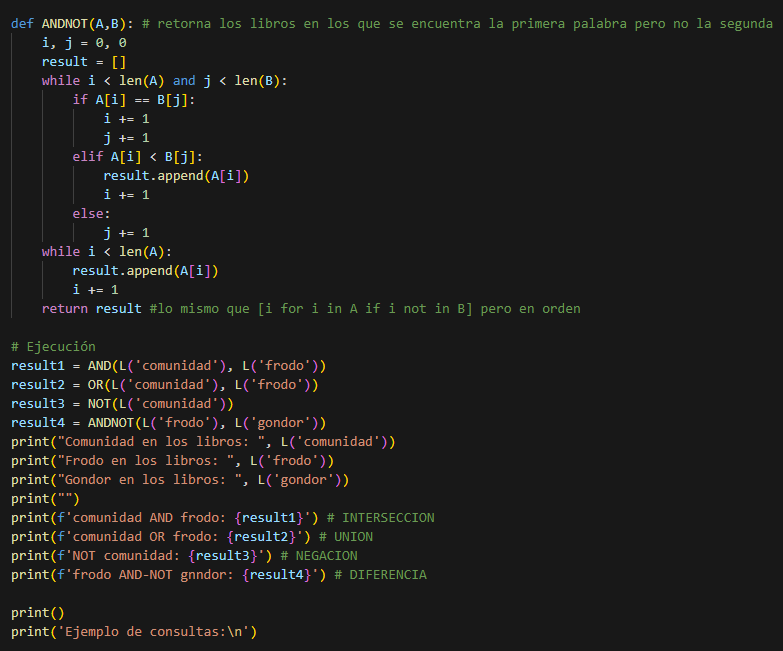
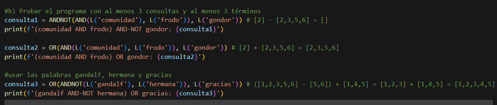

## Informe sobre el Lab 6.2 de Base de Datos 2.

## INTEGRANTES

- Ricardo Amiel Acuña Villogas
- Rodrigo Lauz Nakasone

#### 1. Introducción

- Desarrollo de Índice Invertido para recuperación de documentos .
- Para ello se está ocupando la colección de resúmenes de 6 libros de *"El señor de los anillos"*.

#### 2. Metodología

- **Preprocesamiento**:
  - Se ocupó la librería **nltk(especializada en procesamiento de lenguaje natural)**.
  - Agrego al stoplist.txt signos de puntuación y números por si apareciesen, para eliminar las palabras o signos que más aparezcan, pero que no den una información clara del documento. Luego de ello, se llamó a cada libro.txt y se hizo un split para guardar cada palabra en otros txt, esto se hace para lograr sacar los lexemas en el siguiente paso.
  - La función de preprocesamiento realiza 4 pasos fundamentales => tokenizar, normalizar, sacar lexemas y eliminar stopwords.
  - Adjunto imagen del outuput, el cual retorna una muestra del libro1 preprocesado.
  
  

- **Implementación del Índice Invertido**:
  - Se ocupó la librería **collections**, el cual cuenta con un contador de frecuencias por cada elemento, justo lo que necesitamos. Además, cuenta con un método most_common(n), el cual recibe como parámetro un entero, por lo que de esa manera obtuvimos las 500 palabras más repetidas.
  - La función toma dos listas: la que guarda los 6 libros y la de las n palabras más comunes. Se preprocesan todas, se ordenan alfabéticamente y luego por el libro en el que aparecen. El diccionario guarda como key la palabra y en cuantos libros aparece, y como value guarda el libro y las veces que aparece en él, finalmente se guarda en un archivo txt.
  - Acá hay una muestra de nuestro índice invertido, guarda la palabra y los libros en los que aparece.

    

- **Funciones Booleanas**:
  - Para implementación de las funciones booleanas, es sencillo tomar los libros enumerados del 1 al 6 como enteros, por lo que la comparación fue sencilla de realizar.
  - Nuestra **función L recibe una palabra y la busca en la lista de listas de lexemas de cada libro, y verifica si al sacarle el lexema a la palabra coincide.**. A partir de ello se construyeron las 4 operaciones lógicas **AND, OR, NOT y ANDNOT**. Nos basamos en el pseudocódigo de la ppt, con la única diferencia que los parámetros que recibe son una función L() y los 'pointers' actúan tal cual memoria secundaria, adjunto imagen
  
    

#### 4. Resultados
- **Ejecución de Consultas Booleanas**:
  - Tomé de ejemplo las consultas del laboratorio para probar los operadores lógicos, en base a ello generé 3 consultas que usaban 3 palabras, las 2 primeras consultas ocupan las palabras comunidad, frodo y gondor, por otra parte la tercera consulta fue elegida porque Gandalf es una de las palabras que más aparece en los libros del Señor de los Anillos. Adjunto imagen del output
  
    

#### 5. Conclusiones
- Se ha logrado construir un índice invertido con las 500 palabras más frecuentes. Con la posibilidad de realizar búsqueda por palabra o por lexema debido a la creación de los archivos. En la versión final solo se subió lo requerido, pero se realizaron pruebas ya que el lexema lograba reducir la redundancia que se tenía al guardar por palabras.
- Se han implementado las funciones booleanas para realizar consultas, la librería nltk, re y collections fueron de ayuda por su manera sencilla de manejar los lexemas y generar contadores en los ítems de un diccionario.

## Referencias
- Notas de clase.
- https://docs.python.org/3/library/collections.html
- https://www.nltk.org/

### Fragmento de código por pregunta:
- ÍNDICE INVERTIDO

  
  
- FUNCIONES BOOLEANAS
  
  
  
  
  
  
  
  
